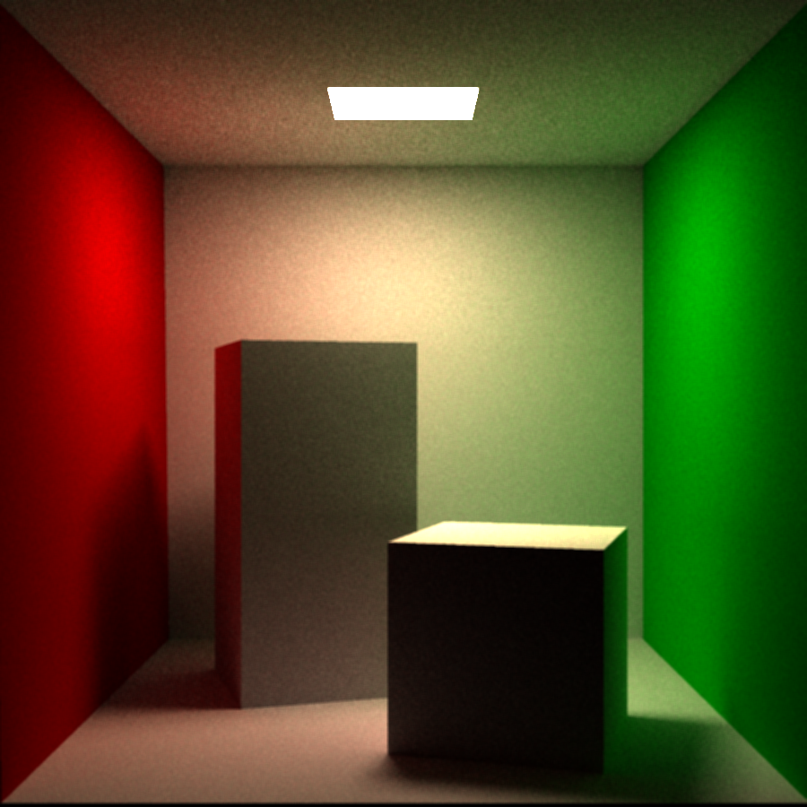

# path tracing 渲染器

### 1. 总览

path tracing是现代计算机图形学中常用的渲染方式，在学术界和工业界都有广泛的应用和研究。该算法从camera出发向场景中发射射线与场景中的物体相交，并对于交点位置计算其直接光照，间接光照。最终通过其他重构，后处理方法生成场景的图像。

处于通用性，一般的光线追踪渲染器在整个算法环节的大多数部分都为用户提供了交互。

本项目主要在以下几方面对于用户提供了交互：场景模型选择,读入，光线追踪加速结构，光源的选择，材质的选择，采样器滤波器的选择，以及渲染方式的选择（直接光照/全局光照）

### 2. 编译

本项目使用`c++17`标准，用`cmake`进行项目的构建。同时引入了`Eigen`数学库及`OpenMP`并行计算库。

执行以下命令编译这个项目：

Windows:

```bash
$ cmake -B build -G “MinGW Makefiles”  
//本项目可以使用Makefile作为生成器，也可以使用微软MSVC作为生成器。考虑到本项目使用OpenMP，在windows平台MinGW可能不方便配置OpenMP，推荐使用默认的MSVC生成器
								
$ cmake --build build --config Release 
//出于运行速度考虑，本项目默认Release版本，也可以使用Debug版本

$ ./Release/pbrt.exe
//运行项目
```

Linux/Mac OS:

```bash
$ cmake -B build -DCMAKE_BUILD_TYPE=Release
//也可以不加-D命令，默认为Release 注：Mac OS上OpenMP可能出现问题，可以将项目中使用OpenMP的地方删去
$ cmake --build build
$ ./pbrt
```

### 3. 代码框架：

项目主要包括两大部分：数据的准备，渲染目标的生成及渲染循环。分别位于`main.cpp`的`preprocess()`和`Init()`函数。所以项目主要的交互部分就是通过修改整两个函数中的部分

由于具体细节涉及图形学专业方面的内容，这里只做大体上的陈述：

整体系统可共分 Acceleration, BxDF, Camera, Filter, Integrator, Interaction, Light, Material, Matrix, Mesh, Primitive, Ray, Sample, Scene, Shape 15个抽象基类。

1. 数据处理部分：

    1. model文件的处理和primitive的初始化：

       通过objLoader将数据读入并存入TriangleMesh类中。并将mesh中的每一个三角形设置一个primitive，结合material数据对primitive进行初始化。（rendering时intersect的图元为primitive）
    
    2. light的处理：
    
       对于Arealight，在model文件读入时对于emit的物体加入一个arealight* 的成员变量，并初始化该成员。
    
       // 3~4 两部分属于数据处理部分但位于`Init()`函数中
    
       3. acceleration的构建：
    
          对所有primitive生成bounding box，使用BVH（主要使用HLBVH或SAH）将primitive（bounding box）划分为不同层级的bounding volume。加速光线intersect的检测。
    
      4. 对Scene，Camera，Filter，Sampler进行初始化：
         Camera存入pos，lookdir等信息，生成view，projection，viewport matrix（将raster space中的一点投射至world space 中)。Scene中存入BVH的指针以及Light的vector。

2. 渲染部分：

   1. render method概览：

      在integrator的render函数内：对film上的每一个pixel进行遍历，对每一个pixel进行采样，对每一个sample生成一个Ray，并计算这条ray上的radiance。再通过filter计算这一点的radiance的film上每一pixel的贡献。

   2. radiance的计算（path tracing）：

      具体原理见 [Path tracing.md](./Path_tracing.md) ，以下说明implementation的细节。首先，当bound=0时，先考虑interaction位置物体的emission。然后计算该interaction的直接光照，乘以当前光路的$\beta$项（bsdf以及pdf）累积（此为光路$P(n)$项的radiance）。再将此值与光路的radiance相加。然后将此interaction的bsdf和pdf积入$\beta$项中，进行下一次bound的计算。最后在bound>3时考虑RussianRoulette。

   3. directLight illumination计算：

      采用multiple importance sampling:
      $$
      \frac{1}{n_f}\sum_{i=1}^{n_f}\frac{f(X_i)g(X_i)\omega_f(X_i)}{p_f(X_i)} + \frac{1}{n_g}\sum_{i=1}^{n_g}\frac{f(X_i)g(X_i)\omega_g(X_i)}{p_g(X_i)}
      $$
      其中$\omega_s(x) = \frac{(n_sp_s(x))^\beta}{\sum_i(n_ip_i(x))^\beta}$

      所以对于L和BSDF我们考虑两次采样，一次对L采样，一次对BSDF采样。

   4. 全局光照：

      涉及过多内容，可以直接认为一点的illumination不仅由直接光照构成，还有其他点对该点的贡献有关，于是在光路中的每一点都可以递归的计算全局光照，多次弹射，计算最终结果。

   5. film的采样与重构：

      由于实际场景中的radiance是连续的，而我们只能用pixel上的值来表示某一区域内的radiance。所以，我们需要对scene的radiance的分布进行采样和重构。根据采样理论，为减少artifact，主要方法有增加采样频率，以及通过随机采样将artifact转化为noise。所以在sampling时，pbrt采用了stratifiedsampling（对每一个pixel划分为n*n个小区域，在每一个区域内random的采样）计算radiance。然后通过filter计算weight以及最终的contribution。

### 4. 参考生成图片：



### 5. 参考文献：

[1] : pbrt (物理渲染——从原理到实现): https://www.pbrt.org/

[2] : Eric Veach:1997 Robust Monte Carlo Methods for Light Transport Simualtion

​	http://graphics.stanford.edu/papers/veach_thesis/

[3] : Heitz et.al :2014 Importance Sampling Miccrofacet-Based BSDFs using the Distribution of  Visble Normals

​	 https://hal.inria.fr/hal-00996995v1/document

[4] : Heitz et al :2014 Understanding the Masking-Shadowing Function in Microfacet-Based BRDFs 

​	https://jcgt.org/published/0003/02/03/paper.pdf