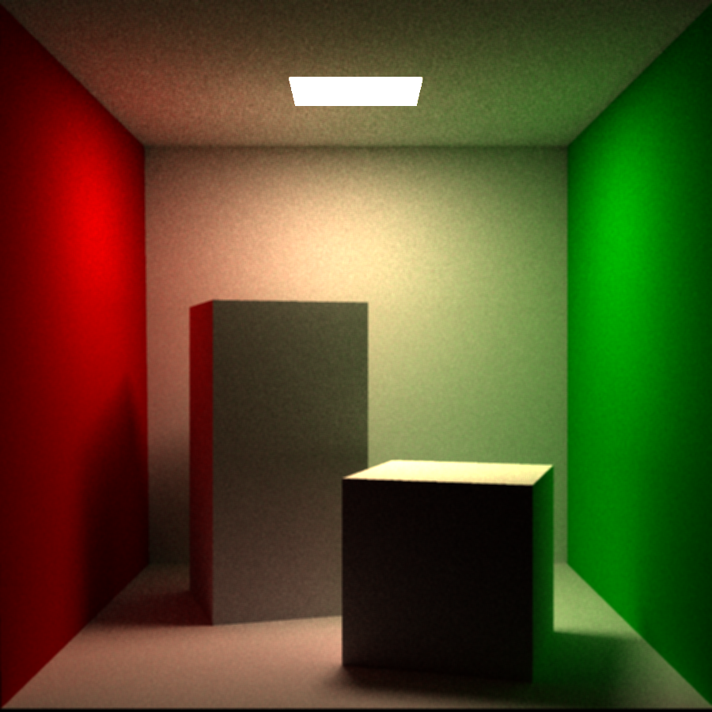

# Physically-Based Path Tracer

**Hangyu Zhang**

A Monte Carlo path tracer renderer implemented in C++, inspired by PBRT (Physically Based Rendering: From Theory to Implementation). It renders 3D scenes using Monte Carlo path tracing with support for various materials (diffuse, specular, metal, subsurface scattering), area lights, acceleration structures and image filers.

----

Rendered using path tracing with multiple importance sampling



## Key Features

### Core Path Tracing

- **Monte Carlo Integration**: Unbiased global illumination using the rendering equation
- **Next Event Estimation**: Directly sampling on light source for every bounce on the paths
- **Multiple Importance Sampling (MIS)**: Combines light sampling and BSDF sampling to reduce variance in direct lighting
- **Indirect Illumination**: Recursive multi-bounce light transport for realistic global illumination

### Material System

Implements physically-based BRDFs and BSDFs:

- **Lambertian Diffuse**: Energy-conserving diffuse reflection
- **Microfacet Models**: Cook-Torrance BRDF for rough conductors and dielectrics
  - GGX/Trowbridge-Reitz normal distribution
  - Smith masking-shadowing function
  - VNDF (Visible Normal Distribution Function) importance sampling
- **Specular Reflection/Refraction**: Perfect mirrors and glass with Fresnel equations
- **Fresnel Effects**: Schlick approximation and exact Fresnel for conductors/dielectrics
- **Subsurface Scattering (BSSRDF)**: Simulates light transport beneath the surface

### Acceleration Structures

- **Bounding Volume Hierarchy (BVH)**: O(log n) ray-primitive intersection
  - **SAH (Surface Area Heuristic)**: Optimizes for ray-AABB intersection performance

### Sampling & Reconstruction

- **Stratified Sampling**: Reduces variance by partitioning sample space (one pixel) into strata
- **Reconstruction Filters**:
  - Mitchell-Netravali filter (high-quality reconstruction)
  - Gaussian filter
  - Box filter
- Converts discrete samples to continuous image via filtering

### Camera Models

- Perspective camera with configurable FOV
- Orthographic camera

### Light System

* Area lights with uniform sampling

## Building and Running

### Prerequisites

- C++17 compiler (GCC 10+, Clang 12+, MSVC 2019+)
- CMake 3.12+
- OpenMP (optional, for parallel rendering)

### Build Instructions

**Windows (Visual Studio):**

```bash
cmake -B build
cmake --build build --config Release
./Release/pbrt.exe
```

**Linux/macOS:**

```bash
cmake -B build -DCMAKE_BUILD_TYPE=Release
cmake --build build
./pbrt
```

## References

[1] : Physically Based Rendering: From Theory to Implementation: https://www.pbrt.org/

[2] : Eric Veach:1997 Robust Monte Carlo Methods for Light Transport Simualtion

​	http://graphics.stanford.edu/papers/veach_thesis/

[3] : Heitz et.al :2014 Importance Sampling Miccrofacet-Based BSDFs using the Distribution of  Visble Normals

​	 https://hal.inria.fr/hal-00996995v1/document

[4] : Heitz et al :2014 Understanding the Masking-Shadowing Function in Microfacet-Based BRDFs 

​	https://jcgt.org/published/0003/02/03/paper.pdf